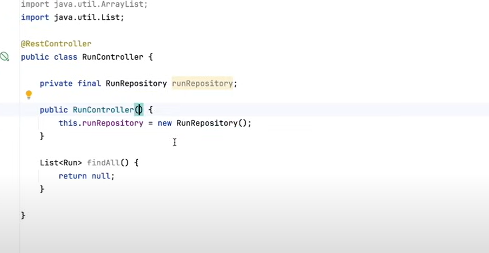
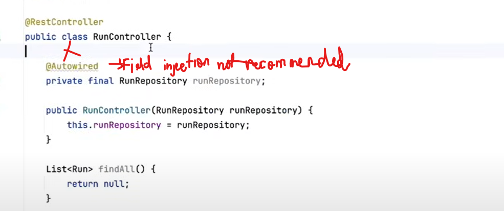
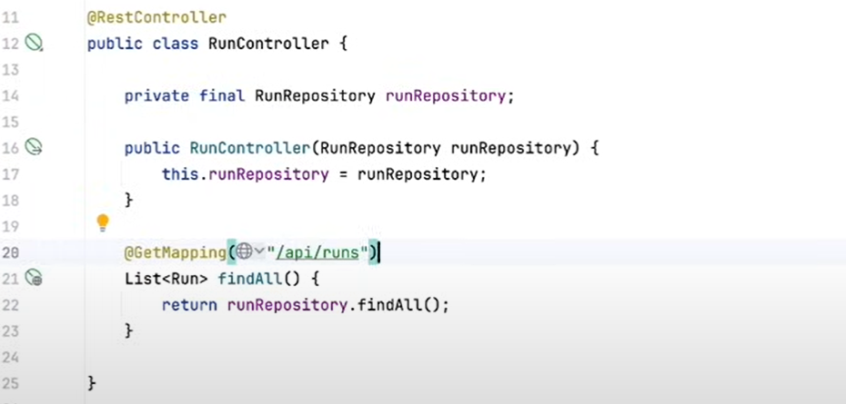

#### Different way to start the application

* Use play button
* by using cmd:
   ` ./mvnw spring-boot:run`
  * Can be found Under the 
  ```
  - maven runner
        - plugin 
            - spring-boot
      
  ```
    
* To check port: `jps`
* To kill: `kill -"code"`

Traditional way to call it,

        // WelcomeMessage.java
        @Component
        public class WelcomeMessage {
            public String getWelcomeMessage(){
                return "Welcome to Spring boot Application";
            }
        }
        
        //Application.java
        var welcomeMessage = new WelcomeMessage();
        System.out.println(welcomeMessage.getWelcomeMessage());

But in spring we don't need to do it like here. That's why we are
using Spring to simplify things.

Huge container of all the classes in application called Application Context,
and we can ask the application context for the particular class. In this case, WelcomeMessage.

Create a context variable from SpringApplication.
Create getBean from that context then save it as welcomeMessage

### BEAN

Bean is nothing more than an instance of a class with some metadata around it.

Instance of a class that the Spring Container, this huge application context is container of Objects is managing for me

#### Special Log

    private static final Logger log = LoggerFactory.getLogger(Application.class);
    
        public static void main(String[] args) {
            SpringApplication.run(Application.class, args);
            log.info("Application started successfully");

We can have structure like **model, controller, service and repository** etc. 
But having like feature function is kind easy to use and can have private access 
within as well.
    Ex: **user, run**

For Model, We need getters, setters, hashCode, equal, toString, Constructor.
But creating by record, we have all inside with that. also those entries immutable(Integer id)

#### MVC (Model View Controller)

**Model**: Model code typically reflects real-world things. This code can hold raw data, or it will define the essential 
components of your app. For instance, if you were building a To-do app, the model code would define what a “task” is and
what a “list” is – since those are the main components of a todo app. 

**View**: View code is made up of all the functions that directly interact with the user. This is the code that makes your 
app look nice, and otherwise defines how your user sees and interacts with it. Just to show up what's reflect for the user
as HTML something, here just API.

**Controller**: Controller code acts as a liaison between the Model and the View, receiving user input and deciding what to 
do with it. It’s the brains of the application, and ties together the model and the view. Controller is a dumb. It's just
receive requests and send the response, nothing else. Basically do CRUD Operations. 

**Repositery**:  Kind of repo to data access. We are accessing DB, but going to encapsulate some data access there.

**Annotation is adding some kind of behaviour to method, classes and fields.**

## Important [Spring Annotations](https://www.jrebel.com/sites/rebel/files/pdfs/cheatsheet-jrebel-spring-annotations.pdf)

Here are the most important annotations any Java developer working with Spring should know:

**@RestController** - We expect the response body to be in some form by default, that's JSON

**@RequestMapping** - This takes the path and request method. but we have specialized version of Mapping as well like GetMapping

**@Configuration** - used to mark a class as a source of the bean definitions. Beans are the components of the system that you want to wire together. A method marked with the @Bean annotation is a bean producer. Spring will handle the life cycle of the beans for you, and it will use these methods to create the beans.

**@ComponentScan** -use to make sure that Spring knows about your configuration classes and can initialize the beans correctly. It makes Spring scan the packages configured with it for the @Configuration classes.

**@Import** -  If you need even more precise control of the configuration classes, you can always use @import  to load additional configuration. This one works even when you specify the beans in an XML file like it's 1999.

**@Component** - Another way to declare a bean is to mark a class with a @Component annotation. Doing this turns the class into a Spring bean at the auto-scan time.

**@Service** - Mark a specialization of a @Component. It tells Spring that it's safe to manage them with more freedom than regular components. Remember, services have no encapsulated state.

**@Autowired** - To wire the application parts together, use the @Autowired on the fields, constructors, or methods in a component. Spring's dependency injection mechanism wires appropriate beans into the class members marked with @Autowired.

**@Bean** - A method-level annotation to specify a returned bean to be managed by Spring context. The returned bean has the same name as the factory method.

**@Lookup** - tells Spring to return an instance of the method's return type when we invoke it.

**@Primary** - gives higher preference to a bean when there are multiple beans of the same type.

**@Required** - shows that the setter method must be configured to be dependency-injected with a value at configuration time. Use @Required on setter methods to mark dependencies populated through XML. Otherwise, a BeanInitializationException is thrown.

**@Value** - used to assign values into fields in Spring-managed beans. It's compatible with the constructor, setter, and field injection.

**@DependsOn** - makes Spring initialize other beans before the annotated one. Usually, this behavior is automatic, based on the explicit dependencies between beans. The @DependsOn annotation may be used on any class directly or indirectly annotated with @Component or on methods annotated with @Bean.

**@Lazy** - makes beans to initialize lazily. @Lazy annotation may be used on any class directly or indirectly annotated with @Component or on methods annotated with @Bean.

**@Scope** - used to define the scope of a @Component class or a @Bean definition and can be either singleton, prototype, request, session, globalSession, or custom scope.

**@Profile** - adds beans to the application only when that profile is active.

**@SpringBootApplication**
One of the most basic and helpful annotations, is @SpringBootApplication. It's syntactic sugar for combining other annotations that we'll look at in just a moment. @SpringBootApplication is @Configuration, @EnableAutoConfiguration and @ComponentScan annotations combined, configured with their default attributes.

**@Configuration and @ComponentScan**
The @Configuration and @ComponentScan annotations that we described above make Spring create and configure the beans and components of your application. It's a great way to decouple the actual business logic code from wiring the app together.

**@EnableAutoConfiguration**
Now the @EnableAutoConfiguration annotation is even better. It makes Spring guess the configuration based on the JAR files available on the classpath. It can figure out what libraries you use and preconfigure their components without you lifting a finger. It is how all the spring-boot-starter libraries work. Meaning it's a major lifesaver both when you're just starting to work with a library as well as when you know and trust the default config to be reasonable.

**@SpringBootApplication**
One of the most basic and helpful annotations, is @SpringBootApplication. It's syntactic sugar for combining other annotations that we'll look at in just a moment. @SpringBootApplication is @Configuration, @EnableAutoConfiguration and @ComponentScan annotations combined, configured with their default attributes.

**@Configuration and @ComponentScan**
The @Configuration and @ComponentScan annotations that we described above make Spring create and configure the beans and components of your application. It's a great way to decouple the actual business logic code from wiring the app together.

**@EnableAutoConfiguration**
Now the @EnableAutoConfiguration annotation is even better. It makes Spring guess the configuration based on the JAR files available on the classpath. It can figure out what libraries you use and preconfigure their components without you lifting a finger. It is how all the spring-boot-starter libraries work. Meaning it's a major lifesaver both when you're just starting to work with a library as well as when you know and trust the default config to be reasonable.

Instead of doing this,

we are creating new instance of Repository for every hit. no need for this.

Do not put Autowired, it will create a issue for testing and field injection is not recommended.

Also, no need to put Autowired to constructor as well, That's implicit. That is what it's doing.

Correct one.


You Can check an endpoint result in cmd as well. Install httpie to use this. Otherwise, use curl as well.
    `http :8080/api/runs`

After defining endpoints and methods, we need to validate those methods.
1. Validator Dependency
2. Custom Throw Exceptions
3. Logical Custom Validation
4. Model Direct validation

To connect with the DB, we are using these dependencies
- H2 db (In memory database)
- jdbc api --> to talk to the database.

Since we are using In memory db, we need special schema to start with.
for that we can add schema.sql in resources folder.

#### Dependency Injection

##### Constructor Based
Initialized through the constructor.

    public class SimpleMovieLister {
    
        // the SimpleMovieLister has a dependency on a MovieFinder
        private final MovieFinder movieFinder;
    
        // a constructor so that the Spring container can inject a MovieFinder
        public SimpleMovieLister(MovieFinder movieFinder) {
            this.movieFinder = movieFinder;
        }
    
        // business logic that actually uses the injected MovieFinder is omitted...
    }

##### Setter Based
Initialized through the setter.

    public class SimpleMovieLister {
    
        // the SimpleMovieLister has a dependency on the MovieFinder
        private MovieFinder movieFinder;
    
        // a setter method so that the Spring container can inject a MovieFinder
        public void setMovieFinder(MovieFinder movieFinder) {
            this.movieFinder = movieFinder;
        }
    
        // business logic that actually uses the injected MovieFinder is omitted...
    }

##### Run JSON Data into DB

```java
package com.aashik.runners.run;

import com.fasterxml.jackson.databind.ObjectMapper;
import org.slf4j.Logger;
import org.slf4j.LoggerFactory;
import org.springframework.asm.TypeReference;
import org.springframework.boot.CommandLineRunner;
import org.springframework.stereotype.Component;

import java.io.IOException;
import java.io.InputStream;

@Component
public class RunJsonDataLoader implements CommandLineRunner {

    private static final Logger log = LoggerFactory.getLogger(RunJsonDataLoader.class);
    private final JdbcClientRunRepository runRepository;
    private final ObjectMapper objectMapper;

    public RunJsonDataLoader(JdbcClientRunRepository runRepository, ObjectMapper objectMapper) {
        this.runRepository = runRepository;
        this.objectMapper = objectMapper;
    }

    @Override
    public void run(String... args) throws Exception {
        if (runRepository.count() == 0) {
            try (InputStream inputStream = TypeReference.class.getResourceAsStream("/data/runs.json")) {
                Runs allRuns = objectMapper.readValue(inputStream, Runs.class);
                log.info("Reading {} runs from JSON Data and saving them to the database", allRuns.runs().size());
                runRepository.saveAll(allRuns.runs());
            } catch (IOException e) {
                throw new RuntimeException("Failed to read JSON data");
            }
        } else {
            log.info("Not loading runs from JSON data because the collection is contains data");
        }
    }
}


```

```java
package com.aashik.runners.run;

import java.util.List;

public record Runs(List<Run> runs) {
}

```

### Using PostgreSQL

Update `application.properties`

```properties
spring.application.name=runnerz
#server.port=8085
#spring.h2.console.enabled=true
#spring.datasource.generate-unique-name=false
spring.datasource.name=runnerz
spring.datasource.url=jdbc:postgresql://localhost:5432/runnerz
spring.datasource.username=
spring.datasource.password=

```

`Schema.sql` will not work anymore when you are running MySQL or PostgreSQL.

PostgreSQL Driver and Docker compose support and Spring Data JDBC.

```xml
        <dependency>
			<groupId>org.springframework.boot</groupId>
			<artifactId>spring-boot-docker-compose</artifactId>
			<scope>runtime</scope>
			<optional>true</optional>
		</dependency>
		<dependency>
			<groupId>org.postgresql</groupId>
			<artifactId>postgresql</artifactId>
			<scope>runtime</scope>
		</dependency>
        <dependency>
        <groupId>org.springframework.boot</groupId>
        <artifactId>spring-boot-starter-data-jdbc</artifactId>
        </dependency>
```

```dockerfile
services:
  postgres:
    image: 'postgres:latest'
    environment:
      - 'POSTGRES_DB=runnerz'
      - 'POSTGRES_PASSWORD=password'
      - 'POSTGRES_USER=aash'
    ports:
      - '5432:5432'
```

We are using this for just the row is existing or new.
```Run record
@Version
Integer version
```

Can run our own query as well.

```java
import org.springframework.data.jdbc.repository.query.Query;

@Repository
public interface RunRepository extends ListCrudRepository<Run, Integer> {

    List<Run> findAllByLocation(String location);

    @Query("SELECT * FROM run WHERE location = :location")
    List<Run> findByLocation(String location);
}

```

Note: 
* To create an object.
  1. [x] context.getBean("nameOfClass").var --> enter, then it will create a Object.
* Also don't put code outside the pkg or in the default pkg.

```
// For the demonstration purpose
    ConfigurableApplicationContext context = SpringApplication.run(Application.class, args);
    WelcomeMessage welcomeMessage = (WelcomeMessage) context.getBean("welcomeMessage");
    System.out.println(welcomeMessage);
  
  ```

